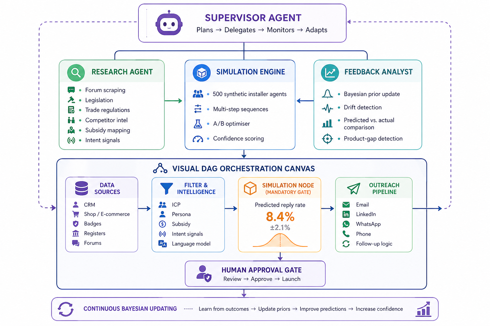

[claude_rewrite](https://docs.google.com/document/d/1Qtb6f0XfnvzuQkAsWq4AORCsBSDcUfSv/edit?usp=sharing&ouid=116239173831631656145&rtpof=true&sd=true)
----
# Autonomous Simulation-First B2B Sales System for European Solar Distribution

## Proposal for Sunlumo Energy — AI Sales Challenge

---


### The Problem

In late 2025, a Reddit post captured the defining failure of autonomous B2B sales: **"Artisan: 1,400 emails sent. Zero replies."** The pattern is structural. Every major platform — Artisan, 11x, Clay, Apollo, Outreach, Salesloft, Cognism — follows a deploy-first, learn-later paradigm. Campaigns hit live prospects. Damage is measured afterward. **No platform on the market offers pre-deployment simulation against synthetic buyer personas before a single email is sent.**

For Sunlumo, the risk is amplified. You target 50,000 to 80,000 installer firms across eight countries, six languages, and irreconcilable regulatory regimes. Cold outreach that works in the Netherlands is illegal in Germany under UWG §7 without explicit consent. WhatsApp dominates installer communication in Italy and Spain; German Handwerk culture remains phone-first. A Polish growth-stage firm and a solo Bavarian Elektromeister inhabit entirely different commercial worlds. Generalist AI sales tools — built by US companies, trained on English SaaS motions, indifferent to European regulatory patchworks — are structurally incapable of operating this motion. **The market is asking for a category of software that does not exist.**

---

### What We Are Building

We propose a **simulation-first, agentic sales operating system purpose-built for European solar distribution.** It is not an incremental improvement over existing platforms. It is an architectural departure built on a single principle: **before any message reaches a real installer, it must survive a war game against synthetic installer personas whose behavior is calibrated against your own historical sales data.**

The system comprises six integrated engines, each embodied as a specialized AI agent operating under a central Supervisor that plans, delegates, monitors, and adapts. The architecture is exposed to your sales team through a **visual directed acyclic graph canvas** — a drag-and-drop orchestration layer where campaigns are designed, simulated, approved, and deployed without writing code. And the core differentiator is the **Simulation Engine**: a multi-step forecasting layer that predicts reply rates, objection patterns, channel preferences, and full-funnel conversion before real outreach begins. **Every probability the system surfaces emerges not from an LLM guessing at likelihoods, but from counting outcomes across parallel simulation runs — each constrained by empirical behavioral priors extracted from your CRM, email history, Intercom logs, and webshop transactions.**

---

### How Simulation Works: The Grounding Methodology

The central question every evaluator will ask: *how do we know these predictions are not hallucinated?* LLMs excel at role-playing conversation. They are terrible at calibrated probability estimation. Our methodology separates these jobs entirely.

**First, we extract behavioral priors from your existing data** — past email campaigns with known reply rates, CRM deal records, Intercom chat logs, webshop order histories, Salesviewer visitor telemetry, and trade-show follow-up outcomes. From these we derive empirical base rates grounded in your reality, not industry averages. A concrete output: *"German solo Elektromeister: historical email-1 reply rate 4.2% from 847 sends; top objection categories: price at 38%, compatibility at 27%, existing supplier at 19%."* These are hard constraints the LLM cannot override.

**Second, each synthetic installer persona is built from three layers, only one of which involves generative AI.** The demographic shell — company size, location, certification — comes from Cognism and national trade registers. The behavioral prior layer carries the empirical ranges from step one: reply-rate band, channel preference, objection distribution. The psychographic layer — communication style, formality register, cultural norms — is LLM-generated but operates within the cage built by the first two. The LLM decides *how* an installer phrases a price objection. It does not decide *whether* they object. That rate comes from the prior.

**Third, probabilities emerge from aggregation, not generation.** The Simulation Orchestrator runs the full multi-step sequence against each persona in the cohort. At every decision point — open, reply, object, convert — the persona makes a weighted random draw within its empirical prior range. The LLM role-plays the resulting conversation. After the run completes, outcomes are simply counted. An 8.4% predicted reply rate means 42 personas replied out of 500. The probability is descriptive, not generative. It is the emergent property of counting under constraint.

**Fourth, we retrodict before we predict.** Three to five of your past campaigns with known outcomes are reconstructed in the simulator — same audience, same copy, same timing. Predicted versus actual reply rates are compared. If the system delivers 5.1% ± 1.8% against your actual 4.8%, calibration is confirmed. This is the standard used in quantitative finance backtesting and epidemiological model validation. We are bringing it to B2B sales simulation for the first time.

**Finally, live Bayesian updating.** Every real campaign outcome feeds back into the model. Priors shift toward observed reality through Bayesian inference. After three campaigns, confidence intervals typically halve. After ten, they converge below ±0.5%. You do not need to believe in the model on faith. You watch the error between predicted and actual shrink, campaign over campaign, on a dashboard.

---

### The System in Motion

**The Sales Workflow Builder** is the control surface: a visual DAG canvas where your team designs campaigns by dragging nodes — data sources, intelligence filters, a mandatory Simulation Node, content generators, channel selectors, conditional branches, and human approval gates — and connecting them into sequences. The canvas ships with three pre-built templates mapped to your known workflows: **post-trade-show blitz** (Intersolar badge scan → enrich → persona-match → simulate → deploy within six hours of event close), **cart-abandonment recovery** (Shopware 6 trigger → intent score → UWG-compliant existing-customer outreach in the installer's native language), and **subsidy-triggered activation** (legislation change detection → affected-installer identification → simulation-optimized messaging → multi-channel deployment within 24 hours of a new KfW or Superbonus announcement). The Simulation Node is a mandatory gate on every path. No campaign deploys without a forecast.

**The Synthetic Personalized Decision Engine** fuses legislative signals, contact purchase history, forum activity, trade-register updates, and live intent telemetry into a unified installer profile that drives personalization at scale. A Research Agent operates continuously in the background: monitoring photovoltaikforum.com for installer sentiment, tracking competitor pricing, scraping legislation portals for changes to KfW 442, Superbonus, MaPrimeRenov', and Poland's "My Electricity" program. A conversational interface lets your team query the knowledge base: *"Which Bavarian installer partners haven't ordered batteries in six months and sit inside enhanced KfW subsidy zones?"*

**The Outreach Pipeline** executes across email, LinkedIn, and WhatsApp Business API — each channel governed by country-specific compliance presets with a visible legal-basis dashboard. The CopyWriter Agent generates native-language copy in German, Italian, French, Spanish, Polish, and Dutch — not machine-translated, but composed with correct formality registers, sector vocabulary, and cultural conventions per market. Smart follow-up logic classifies every reply, handles objections autonomously when confidence is high, and escalates ambiguous cases to human review. Every outcome is tracked against its simulation prediction, making the forecast-to-reality gap permanently visible and continuously shrinking.

**The Feedback Reactor** closes the loop. The Feedback Analyst compares predicted versus actual at every funnel stage, updates priors through Bayesian inference, and surfaces strategically actionable insights: *"WhatsApp-first sequences for Italian installers outperform email-first by 2.7× — updating channel recommendations for all future IT campaigns."* It also powers a product-market fit backrun: aggregating installer objections, compatibility gaps, and feature requests across all campaigns to detect portfolio blind spots — *"230 Polish installers requested ≤5 kWh residential batteries this quarter, a capacity absent from the current catalog"* — turning the sales system into a strategic intelligence layer.


---

### The First Thirty Days

Our MVP wedge targets the fastest, warmest, most compliant path to demonstrable ROI. **Phase one:** a cart-abandonment and cross-sell agent on Sunlumo's Shopware 6 webshop — existing-customer basis, fully UWG-compliant, measurable conversion uplift within thirty days. **Phase two:** the post-trade-show workflow — badge scans ingested, enriched, simulated, and deployed within hours of Intersolar and EES closing. **Phase three:** Salesviewer deanonymization triggers driving personalized agentic follow-up to companies already browsing your site.

The simulation engine itself is productizable beyond Sunlumo. We envision **SalesLab** — a standalone campaign-testing SaaS sold to European distributors in adjacent verticals — with this engagement as the reference case that defines a new category.

---

```
                    ┌─────────────────────────────────────────┐
                    │          SUPERVISOR AGENT               │
                    │     Plans → Delegates → Adapts          │
                    └──────────────────┬──────────────────────┘
                                       │
     ┌─────────────────────────────────┼──────────────────────────────┐
     │                                 │                              │
     ▼                                 ▼                              ▼
┌──────────────┐             ┌──────────────────┐          ┌───────────────────┐
│  RESEARCH    │             │   SIMULATION     │          │    FEEDBACK       │
│  AGENT       │────────────▶│   ENGINE (GATE)  │◀─────────│    ANALYST        │
│              │             │                  │          │                   │
│ • Legislation│             │ Multi-step       │          │ Bayesian update   │
│ • Trade reg. │             │ persona-grounded │          │ Predicted vs.     │
│ • Forums     │             │ sequence forecast│          │ actual comparison │
│ • Competitor │             │ A/B optimiser    │          │ Product-gap       │
│ • Subsidies  │             │ Confidence score │          │ detection         │
└──────┬───────┘             └────────┬─────────┘          └─────────┬─────────┘
       │                              │                              │
       ▼                              ▼                              │
┌────────────────────────────────────────────────────────────────────┼──┐
│                   VISUAL DAG ORCHESTRATION CANVAS                  │  │
│                                                                    │  │
│  ┌──────────┐    ┌──────────┐    ┌──────────┐    ┌──────────┐     │  │
│  │  DATA    │    │FILTER &  │    │SIMULATION│    │ OUTREACH │     │  │
│  │ SOURCES  │───▶│INTELLIG. │───▶│   NODE   │───▶│ PIPELINE │─────┘  │
│  │          │    │          │    │(MANDATORY│    │          │        │
│  │• CRM     │    │• ICP     │    │  GATE)   │    │• Email   │        │
│  │• Shop    │    │• Persona │    │          │    │• LinkedIn│        │
│  │• Badges  │    │• Subsidy │    │Forecast: │    │• WhatsApp│        │
│  │• Register│    │• Intent  │    │  reply    │    │• Native  │        │
│  │• Forums  │    │• Language│    │  rate     │    │  lang.   │        │
│  └──────────┘    └──────────┘    └────┬─────┘    └──────────┘        │
│                                       │                              │
│                            ┌──────────▼────────┐                    │
│                            │  HUMAN APPROVAL   │                    │
│                            │  Review → Approve │                    │
│                            └───────────────────┘                    │
└─────────────────────────────────────────────────────────────────────┘

  ◀───────────────── continuous Bayesian updating ─────────────────▶

Priors extracted from Sunlumo's CRM + email history + chat logs + webshop data.
Simulation runs on 6–8 synthetic installer archetypes built from Cognism + trade registers.
Probabilities emerge from counting, not LLM generation. Every campaign tightens the model.
```
